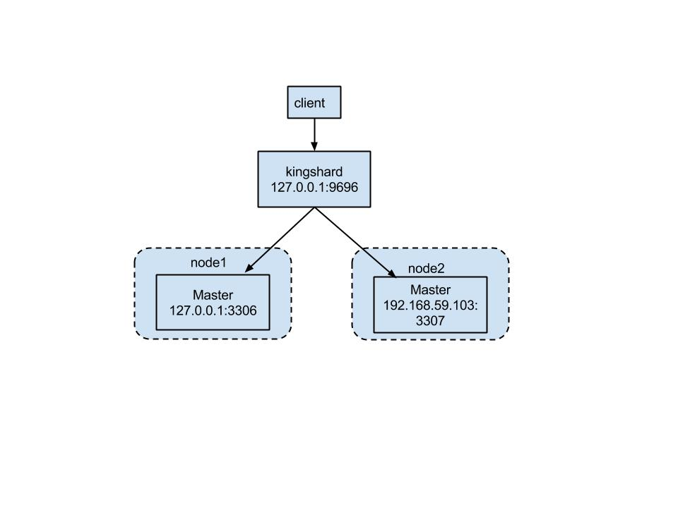

# 如何利用一个数据库中间件扩展MySQL集群——kingshard使用指南

上次写了一篇有关kingshard架构设计的[文章](./architecture_of_kingshard_CN.md),得到了很多热心网友的关注。其中有网友提到：希望再写一篇关于如何利用kingshard搭建一个可扩展的MySQL集群的文档。利用假期时间，写了一篇kingshard使用指南，在这篇文章中，我将结合自己对MySQL Proxy的理解，为大家讲述如何正确使用kingshard数据库中间件。

## 1. kingshard的应用场景

现在很多互联网公司还是在大量使用MySQL来存储各种类型的关系型数据。随着访问量和数据量的增长，开发者不得不考虑一些MySQL相关的新问题：

1. 读写分离问题。由于前端应用访问量增加，单台MySQL不足以支撑整个系统的写入和查询操作。这时候，我们不得不将一些耗时的查询操作分散到多个slave上。
2. 单表容量问题。如果在系统设计之初，没有考虑到分表问题。随着数据量的增长，单表容量越来越大。作者见过单表容量5亿条记录，然后一个简单的delete操作都会引起系统慢日志，而且有可能导致MySQL IO瞬发性的飙升。很多同学可能会想到，在查询的字段上加上索引，但当数据量增长到这么大的时候，即使加上索引效果也不明显了。归根结底，就是单表数据量太大，导致MySQL即使通过索引定位数据，仍然需要扫描很多记录。
3. 数据库的运维问题。如果在代码中配置主库和从库host，系统运行当然也是没问题的。但这样大大增加了运维工作的压力，比如：MySQL数据库IO压力由于访问量的增加居高不下，DBA需要添加一台slave，这时候就不得不修改代码，然后打包并上线。还有很多非常实际的例子，在这就不一一列举。
4. 连接池。前端应用频繁连接MySQL，由此给MySQL带来的额外性能消耗也是不容忽视的。如果通过增加一个连接池，每个DB缓存一定数量的MySQL连接，当有应用需要连接后端的MySQL，直接从连接池里取出一个已建好的连接来发送SQL请求，这样会大大加快数据查询速度。而且可以降低MySQL的性能消耗。
5. SQL日志。在程序出现问题时，我们希望得到一些SQL日志，比如，什么时刻哪条SQL发送到哪一台DB上了。通过查看这种日志能够帮助我们快速定位问题。

面对这些问题，我们可以在客户端代码中逐一实现。但这样也会使得客户端越来越重，不那么灵活。作者一直从事数据库相关工作的开发，正是基于数据库开发的痛点，设计和实现了kingshard数据库中间件。kingshard对上述5类问题都有比较合适的解决方案。下面对kingshard的主要功能，逐个介绍并演示一下。

## 2. 安装和启动说明

### (1). 设置配置文件

下面给出一个配置文件范例，用户可以自行按照自己的需求逐项配置：

```
# kingshard的地址和端口
addr : 0.0.0.0:9696

# 连接kingshard的用户名和密码的用户列表
-user_list:
-
    user :  kingshard
    password : kingshard
#kingshard的web API 端口
web_addr : 0.0.0.0:9797
#调用API的用户名和密码
web_user : admin
web_password : admin

# log级别，[debug|info|warn|error],默认是error
log_level : debug
# 打开SQL日志，设置为on;关闭SQL日志，设置为off
log_sql : on
#如果设置了该项，则只输出SQL执行时间超过slow_log_time(ms)的SQL日志，不设置则输出全部SQL日志
slow_log_time : 100
#日志文件路径，如果不配置则会输出到终端。
log_path : /Users/flike/log
# sql黑名单文件路径
# 所有在该文件中的sql都会被kingshard拒绝转发
#blacklist_sql_file: /Users/flike/blacklist
# 只允许下面的IP列表连接kingshard，如果不配置则对连接kingshard的IP不做限制。
allow_ips: 127.0.0.1
# kingshard使用的字符集，如果不设置该选项，则kingshard使用utf8作为默认字符集
#proxy_charset: utf8mb4

# 一个node节点表示mysql集群的一个数据分片，包括一主多从（可以不配置从库）
nodes :
-
    #node节点名字
    name : node1

    # 连接池中最大的空闲连接数，也就是kingshard最多与后端DB建立max_conns_limit个连接
    max_conns_limit : 16

    # kingshard连接该node中mysql的用户名和密码，master和slave的用户名和密码必须一致
    user :  kingshard
    password : kingshard

    # master的地址和端口
    master : 127.0.0.1:3306

    # slave的地址和端口，可不配置
    #slave : 192.168.0.12@2,192.168.0.13@3
    #kingshard在300秒内都连接不上mysql，kingshard则会下线该mysql
    down_after_noalive : 300
-
    name : node2
    max_conns_limit : 16
    user :  kingshard
    password : kingshard

    master : 192.168.59.103:3307
    slave :
    down_after_noalive: 100

# 各用户的分表规则
schema_list :
-
    #schema的所属用户名
    user: kingshard
    #分表分布的node名字
    nodes: [node1,node2]
	#所有未分表的SQL，都会发往默认node。
    default: node1
    shard:
    -
        #分表使用的db
        db : kingshard
		#分表名字
        table: test_shard_hash
        #分表字段
        key: id
        #分表分布的node
        nodes: [node1, node2]
        #分表类型
        type: hash
        #子表个数分布，表示node1有4个子表，
        #node2有4个子表。
        locations: [4,4]

    -
		#分表使用的db
        db : kingshard
        #分表名字
        table: test_shard_range
	    #分表字段
        key: id
		#分表类型
        type: range
	    #分表分布的node
        nodes: [node1, node2]
		#子表个数分布，表示node1有4个子表，
		#node2有4个子表。
        locations: [4,4]
        #表示每个子表包含的最大记录数，也就是说每
	    #个子表最多包好10000条记录。即子表1对应的id为[0,10000),子表2[10000,20000)....
        table_row_limit: 10000

```
这里着重说一下分表的配置规则：

* kingshard支持两种类型的分表规则：hash和range。
* kingshard分表涉及到的子表，需要用户在各个db手动创建好，并且格式是：`table_name_%4d`,也就是说子表下标由4位数组成。例如:`table_name_0000,table_name_0102`。
* 所有操作未分表的SQL语句都将发送到默认节点。

### (2). 安装和启动kingshard

1. 安装Go语言环境（请使用最新版），具体步骤请Google。
2. git clone https://github.com/flike/kingshard.git src/github.com/flike/kingshard
3. cd src/github.com/flike/kingshard
4. source ./dev.sh
5. make
6. 设置配置文件
7. 运行kingshard ./bin/kingshard -config=etc/ks.yaml

**注意：kingshard会响应SIGINT,SIGTERM,SIGQUIT这三个信号，平滑退出。在部署kingshard机器上应避免产生这三个信号，以免造成kingshard非正常退出！后台运行kingshard建议使用supervisor工具**

## 3. 跨节点分表
由于作者的只有两台MySQL，所以搭建了两个节点，这两个节点都只有一台Master 角色的MySQL数据库，具体的拓扑图如下所示：


### 3.1. 分表操作演示
分表操作有hash和range两种类型，在这里只演示hash类型的分表操作，range类型的分表类似，就不再赘述了。
#### 3.1.1. 手动创建子表
在node1和node2上各创建4张子表，下面只给出在node1上`test_shard_hash_0000`的建表SQL语句，其他子表的建表SQL语句类似。node1包含：`test_shard_hash_0000, test_shard_hash_0001, test_shard_hash_0002, test_shard_hash_0003`。node2包含：`test_shard_hash_0004, test_shard_hash_0005, test_shard_hash_0006, test_shard_hash_0007`。

```
CREATE TABLE `test_shard_hash_0000` (
  `id` bigint(64) unsigned NOT NULL,
  `str` varchar(256) DEFAULT NULL,
  `f` double DEFAULT NULL,
  `e` enum('test1','test2') DEFAULT NULL,
  `u` tinyint(3) unsigned DEFAULT NULL,
  `i` tinyint(4) DEFAULT NULL,
  PRIMARY KEY (`id`)
) ENGINE=InnoDB DEFAULT CHARSET=utf8
```

### 3.1.2. 分表的插入和查询
执行下面SQL语句，根据查询的结果可以看出SQL语句根据分表规则落到不同的子表。查询操作（select）可以跨多个node，当更新操作涉及到多个node时，kingshard会以非事务的方式执行跨node的更新。为了保证数据一致性，请根据实际需求使用非事务方式的跨node更新操作。

```
mysql> insert into test_shard_hash(id,str,f,e,u,i) values(15,"flike",3.14,'test2',2,3);
Query OK, 1 row affected (0.01 sec)

mysql> mysql> insert into test_shard_hash(id,str,f,e,u,i) values(7,"chen",2.1,'test1',32,3);
Query OK, 1 row affected (0.01 sec)

mysql> insert into test_shard_hash(id,str,f,e,u,i) values(17,"github",2.5,'test1',32,3);
Query OK, 1 row affected (0.00 sec)

mysql> insert into test_shard_hash(id,str,f,e,u,i) values(18,"kingshard",7.3,'test1',32,3);
Query OK, 1 row affected (0.01 sec)
```
对应的SQL日志如下所示：

```
2015/09/02 18:48:24 - INFO - 127.0.0.1:55003->192.168.59.103:3307:insert into test_shard_hash_0007(id, str, f, e, u, i) values (15, 'flike', 3.14, 'test2', 2, 3)
2015/09/02 18:49:05 - INFO - 127.0.0.1:55003->192.168.59.103:3307:insert into test_shard_hash_0007(id, str, f, e, u, i) values (7, 'chen', 2.1, 'test1', 32, 3)
2015/09/02 18:49:51 - INFO - 127.0.0.1:55003->127.0.0.1:3306:insert into test_shard_hash_0001(id, str, f, e, u, i) values (17, 'github', 2.5, 'test1', 32, 3)
2015/09/02 18:50:21 - INFO - 127.0.0.1:55003->127.0.0.1:3306:insert into test_shard_hash_0002(id, str, f, e, u, i) values (18, 'kingshard', 7.3, 'test1', 32, 3)
```
可以看到前两条SQL发送到了node2的master上了，后两条SQL发送到node1上的master了。

然后我们可以用select语句查看数据，且select支持跨node查询。

```
mysql> select * from test_shard_hash where id < 18;
+----+--------+------+-------+------+------+
| id | str    | f    | e     | u    | i    |
+----+--------+------+-------+------+------+
| 17 | github |  2.5 | test1 |   32 |    3 |
|  7 | chen   |  2.1 | test1 |   32 |    3 |
| 15 | flike  | 3.14 | test2 |    2 |    3 |
+----+--------+------+-------+------+------+
3 rows in set (0.02 sec)
```

因为是hash类型的分表，所以对于select范围类型的查询，必须查询每一个子表。对应的SQL日志如下所示：

```
2015/09/02 18:55:01 - INFO - 127.0.0.1:55003->127.0.0.1:3306:select * from test_shard_hash_0000 where id < 18
2015/09/02 18:55:01 - INFO - 127.0.0.1:55003->127.0.0.1:3306:select * from test_shard_hash_0001 where id < 18
2015/09/02 18:55:01 - INFO - 127.0.0.1:55003->127.0.0.1:3306:select * from test_shard_hash_0002 where id < 18
2015/09/02 18:55:01 - INFO - 127.0.0.1:55003->127.0.0.1:3306:select * from test_shard_hash_0003 where id < 18
2015/09/02 18:55:01 - INFO - 127.0.0.1:55003->192.168.59.103:3307:select * from test_shard_hash_0004 where id < 18
2015/09/02 18:55:01 - INFO - 127.0.0.1:55003->192.168.59.103:3307:select * from test_shard_hash_0005 where id < 18
2015/09/02 18:55:01 - INFO - 127.0.0.1:55003->192.168.59.103:3307:select * from test_shard_hash_0006 where id < 18
2015/09/02 18:55:01 - INFO - 127.0.0.1:55003->192.168.59.103:3307:select * from test_shard_hash_0007 where id < 18
```
对应等值的select查询，kingshard会计算出具体命中的子表，然后只会在相应的子表中查询。对应的SQL如下所示：

```
mysql> select * from test_shard_hash where id = 18;
+----+-----------+------+-------+------+------+
| id | str       | f    | e     | u    | i    |
+----+-----------+------+-------+------+------+
| 18 | kingshard |  7.3 | test1 |   32 |    3 |
+----+-----------+------+-------+------+------+
1 row in set (0.00 sec)
```
对应的SQL日志如下所示：

```
2015/09/02 18:59:37 - INFO - 127.0.0.1:55003->127.0.0.1:3306:select * from test_shard_hash_0002 where id = 18
```

### 3.1.3. 分表的更新
当更新的记录落在同一个子表时，kingshard支持这类操作。在上面插入的记录中，id为7和15的记录都落在`test_shard_hash_0007`中，所以可以成功地执行下面的SQL：

```
mysql> update test_shard_hash set u=123 where id = 15 or id = 7;
Query OK, 2 rows affected (0.01 sec)
```
对应的SQL日志是：

```
2015/09/02 19:17:27 - INFO - 127.0.0.1:55003->192.168.59.103:3307:update test_shard_hash_0007 set u = 123 where id = 15 or id = 7
```

当更新的记录落在不同的子表，kingshard会以非事务的方式将更新操作发送到多个node上。例如执行如下SQL：

```
mysql> update test_shard_hash set str="myworld_test4" where id in(128,1,231);
Query OK, 3 rows affected (0.02 sec)
```
对应的SQL日志是：

```
2016/03/15 15:18:27 - OK - 1.2ms - 127.0.0.1:60730->127.0.0.1:3306:update test_shard_hash_0000 set str = 'myworld_test4' where id in (128, 1, 231)
2016/03/15 15:18:27 - OK - 0.5ms - 127.0.0.1:60730->127.0.0.1:3306:update test_shard_hash_0001 set str = 'myworld_test4' where id in (128, 1, 231)
2016/03/15 15:18:27 - OK - 6.8ms - 127.0.0.1:60730->192.168.59.103:3307:update test_shard_hash_0007 set str = 'myworld_test4' where id in (128, 1, 231)
```

### 3.2. 指定发送的node

有时候我们需要操作的表，不在default node中。在kingshard中允许用户将特定的sql路由到指定的node上。只需要在sql语句前面加上包含node名称的注释(连接MySQL时需要加上-c选项，避免客户端过滤掉注释)。

```
mysql> /*node2*/show tables;
+-----------------------+
| Tables_in_kingshard   |
+-----------------------+
| kingshard_test_conn   |
| test_shard_hash_0004  |
| test_shard_hash_0005  |
| test_shard_hash_0006  |
| test_shard_hash_0007  |
| test_shard_range_0004 |
| test_shard_range_0005 |
| test_shard_range_0006 |
| test_shard_range_0007 |
+-----------------------+
9 rows in set (0.03 sec)

mysql> /*node2*/select * from kingshard_test_conn;
Empty set (0.01 sec)

mysql> /*node2*/desc kingshard_test_conn;
+-------+-----------------------+------+-----+---------+-------+
| Field | Type                  | Null | Key | Default | Extra |
+-------+-----------------------+------+-----+---------+-------+
| id    | bigint(20) unsigned   | NO   | PRI | NULL    |       |
| str   | varchar(256)          | YES  |     | NULL    |       |
| f     | double                | YES  |     | NULL    |       |
| e     | enum('test1','test2') | YES  |     | NULL    |       |
| u     | tinyint(3) unsigned   | YES  |     | NULL    |       |
| i     | tinyint(4)            | YES  |     | NULL    |       |
+-------+-----------------------+------+-----+---------+-------+
6 rows in set (0.00 sec)

mysql> /*node2*/insert into kingshard_test_conn values(10,"hello",10.2,'test1',1,1);
Query OK, 1 row affected (0.00 sec)

mysql> /*node2*/select * from kingshard_test_conn;
+----+-------+------+-------+------+------+
| id | str   | f    | e     | u    | i    |
+----+-------+------+-------+------+------+
| 10 | hello | 10.2 | test1 |    1 |    1 |
+----+-------+------+-------+------+------+
1 row in set (0.00 sec)
```

### 3.3. 强制读主库
有时候在主库中插入数据后，希望立即从主库读出来。在kingshard中由于读写分离的原因，select默认会发送到相应node的从库上。但是只需要在select语句中加入相应的注释项（`/*master*/`)，就可以将select语句发送到主库。

```
mysql> select/*master*/ * from kingshard_test_conn;
+----+----------+------+-------+------+------+
| id | str      | f    | e     | u    | i    |
+----+----------+------+-------+------+------+
|  1 | a        | 3.14 | test1 | NULL | NULL |
|  5 | ""''\abc | NULL | NULL  | NULL | NULL |
|  6 | 中国     | NULL | NULL  | NULL | NULL |
+----+----------+------+-------+------+------+
3 rows in set (0.01 sec)
```

### 3.4. 跨node的sum和count函数
在kingshard中，支持sum和count函数，kingshard会将相应的SQL发送到正确的DB，并将结果合并起来再返回给客户的。例如：

```
mysql> select count(id) from test_shard_hash where id > 1;
+-----------+
| count(id) |
+-----------+
|         4 |
+-----------+
1 row in set (0.02 sec)

mysql> select sum(id) from test_shard_hash where id > 1;
+---------+
| sum(id) |
+---------+
|      57 |
+---------+
1 row in set (0.02 sec)
```

相应的SQL日志如下所示：

```
2015/09/03 14:49:01 - INFO - 127.0.0.1:55768->127.0.0.1:3306:select count(id) from test_shard_hash_0000 where id > 1
2015/09/03 14:49:01 - INFO - 127.0.0.1:55768->127.0.0.1:3306:select count(id) from test_shard_hash_0001 where id > 1
2015/09/03 14:49:01 - INFO - 127.0.0.1:55768->127.0.0.1:3306:select count(id) from test_shard_hash_0002 where id > 1
2015/09/03 14:49:01 - INFO - 127.0.0.1:55768->127.0.0.1:3306:select count(id) from test_shard_hash_0003 where id > 1
2015/09/03 14:49:01 - INFO - 127.0.0.1:55768->192.168.59.103:3307:select count(id) from test_shard_hash_0004 where id > 1
2015/09/03 14:49:01 - INFO - 127.0.0.1:55768->192.168.59.103:3307:select count(id) from test_shard_hash_0005 where id > 1
2015/09/03 14:49:01 - INFO - 127.0.0.1:55768->192.168.59.103:3307:select count(id) from test_shard_hash_0006 where id > 1
2015/09/03 14:49:01 - INFO - 127.0.0.1:55768->192.168.59.103:3307:select count(id) from test_shard_hash_0007 where id > 1
2015/09/03 14:49:14 - INFO - 127.0.0.1:55768->127.0.0.1:3306:select sum(id) from test_shard_hash_0000 where id > 1
2015/09/03 14:49:14 - INFO - 127.0.0.1:55768->127.0.0.1:3306:select sum(id) from test_shard_hash_0001 where id > 1
2015/09/03 14:49:14 - INFO - 127.0.0.1:55768->127.0.0.1:3306:select sum(id) from test_shard_hash_0002 where id > 1
2015/09/03 14:49:14 - INFO - 127.0.0.1:55768->127.0.0.1:3306:select sum(id) from test_shard_hash_0003 where id > 1
2015/09/03 14:49:14 - INFO - 127.0.0.1:55768->192.168.59.103:3307:select sum(id) from test_shard_hash_0004 where id > 1
2015/09/03 14:49:14 - INFO - 127.0.0.1:55768->192.168.59.103:3307:select sum(id) from test_shard_hash_0005 where id > 1
2015/09/03 14:49:14 - INFO - 127.0.0.1:55768->192.168.59.103:3307:select sum(id) from test_shard_hash_0006 where id > 1
2015/09/03 14:49:14 - INFO - 127.0.0.1:55768->192.168.59.103:3307:select sum(id) from test_shard_hash_0007 where id > 1
```

### 3.5. 跨node的order by
kingshard支持跨node的select操作使用order by，kingshard先将合适的SQL发生到对应的node，然后将结果集在内存中排序，从而实现select的order by操作。示例如下所示：

```
mysql> select * from test_shard_hash where id > 1 order by id;
+----+-----------+------+-------+------+------+
| id | str       | f    | e     | u    | i    |
+----+-----------+------+-------+------+------+
|  7 | chen      |  2.1 | test1 |  123 |    3 |
| 15 | flike     | 3.14 | test2 |  123 |    3 |
| 17 | github    |  2.5 | test1 |   32 |   23 |
| 18 | kingshard |  7.3 | test1 |   32 |   23 |
+----+-----------+------+-------+------+------+
4 rows in set (0.02 sec)
```

对应的SQL日志为：

```
2015/09/03 14:54:11 - INFO - 127.0.0.1:55768->127.0.0.1:3306:select * from test_shard_hash_0000 where id > 1 order by id asc
2015/09/03 14:54:11 - INFO - 127.0.0.1:55768->127.0.0.1:3306:select * from test_shard_hash_0001 where id > 1 order by id asc
2015/09/03 14:54:11 - INFO - 127.0.0.1:55768->127.0.0.1:3306:select * from test_shard_hash_0002 where id > 1 order by id asc
2015/09/03 14:54:11 - INFO - 127.0.0.1:55768->127.0.0.1:3306:select * from test_shard_hash_0003 where id > 1 order by id asc
2015/09/03 14:54:11 - INFO - 127.0.0.1:55768->192.168.59.103:3307:select * from test_shard_hash_0004 where id > 1 order by id asc
2015/09/03 14:54:11 - INFO - 127.0.0.1:55768->192.168.59.103:3307:select * from test_shard_hash_0005 where id > 1 order by id asc
2015/09/03 14:54:11 - INFO - 127.0.0.1:55768->192.168.59.103:3307:select * from test_shard_hash_0006 where id > 1 order by id asc
2015/09/03 14:54:11 - INFO - 127.0.0.1:55768->192.168.59.103:3307:select * from test_shard_hash_0007 where id > 1 order by id asc
```
## 4. 单node的事务
kingshard支持在单个node上执行事务，也就是说同一个事务不能跨多个node，当出现跨node的情况时，kingshard会返回错误给客户端。可以跨同node上的不同子表。示例如下所示：

```
mysql> begin;
Query OK, 0 rows affected (0.00 sec)

mysql> insert into test_shard_hash(id,str,f,e,u,i) values(23,'proxy',9.2,'test1',12,3);
Query OK, 1 row affected (0.00 sec)

mysql> commit;
Query OK, 0 rows affected (0.01 sec)
```

当在一个事务中，出现跨node的SQL语句时，kingshard会返回错误：

```
#SQL语句在node2中执行
mysql> insert into test_shard_hash(id,str,f,e,u,i) values(31,'proxy',9.2,'test1',12,3);
Query OK, 1 row affected (0.01 sec)
#SQL语句在需要在node1执行，跨node了。
mysql> insert into test_shard_hash(id,str,f,e,u,i) values(40,'proxy',9.2,'test1',12,3);
ERROR 1105 (HY000): transaction in multi node
```

## 6. kingshard的管理端操作
kingshard的管理接口，目前还是命令行的方式。后续有时间打算将其改成web方式。管理端具体的命令可以参考[文档](./admin_command_introduce.md)。管理端的命令格式，可以分为两类：

* ` admin server(opt,k,v) values(action,k1,v1)`。这种命令是操作整个kingshard的，其中opt表示这个操作的动作；k表示操作的对象，v表示给对象的赋值。
* `admin node(opt,node,k,v) values(action,nodeName,k1,v1)`,这类命令表示操作node。其中opt表示这个操作的动作；node表示操作哪个node；k表示操作的对象，v表示给对象的赋值。

## 7. 总结
kingshard开源两个月以来，得到了很多开发者的关注。这足以证明，大家对数据库中间件是有需求的，希望出现一款简单好用的MySQL Proxy。kingshard经过这两个月的迭代开发，也比较稳定了。据了解，有几个公司正在对其进行尝试。后续作者的主要精力会放在优化kingshard的性能上，同时完善kingshard已有的功能。如果大家对kingshard有什么想法或建议，可以发邮件联系我（flikecn#126.com)，非常乐意和大家交流。


