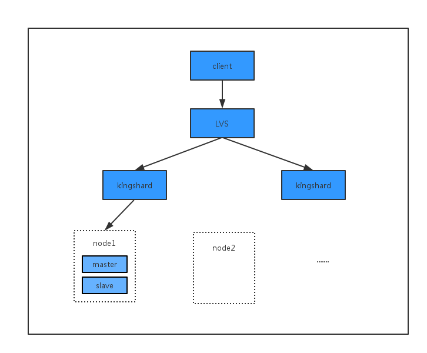

# 如何使用ks+lvs实现完美集群
## 1.前言

    很多ks的用户会问到ks如何配合LVS做流量切换?ks如何配合keepalived做高可用?ks如何做到不停系统升级?
通过ks提供的状态监测和状态切换命令, 配合一些第三方组件, 可以实现一个完美的mysql中间件集群。

## 2.配合LVS进行流量切换

### 2.1.LVS通过该命令监测ks存活信息
```
admin server(opt,k,v) values('show','proxy','status')
```

如果得到的结果是"online", LVS正常分流到该ks;如果得到的结果是"offline"或者"连接错误",LVS认为该real server节点不可用, LVS将不会分流到该ks。
### 2.2.LVS手动分流过程
```
admin server(opt,k,v) values('change','proxy','offline')
```
通过上述命令, LVS在下个侦查周期监测到该real server节点状态为offline, 将不会分流到该ks, 当观察到当前节点没有正在处理的请求之后, 我们可以对ks进行配置变更、代码升级等操作。

## 3.配合keepalived做高可用架构

3.1keepalived检测脚本通过该命令进行real server保活检测
```
admin server(opt,k,v) values('show','proxy','status')
```
如果得到的结果是"online", keepalived虚拟IP绑定在主ks实例上，不会漂移;如果检测到状态是"offline"或者"连接错误",keepalived认为主ks实例不可用，虚拟IP漂移到从ks实例上，从而实现高可用。
3.2高可用手动触发流程
```
admin server(opt,k,v) values('change','proxy','offline')
```
通过上述命令，将其中一台ks状态置为下线，正常情况下可以看到虚拟IP漂移到另外一台ks主机上,当观察到当前节点没有正在处理的请求之后，我们可以对ks进行配置变更、代码升级等操作。
