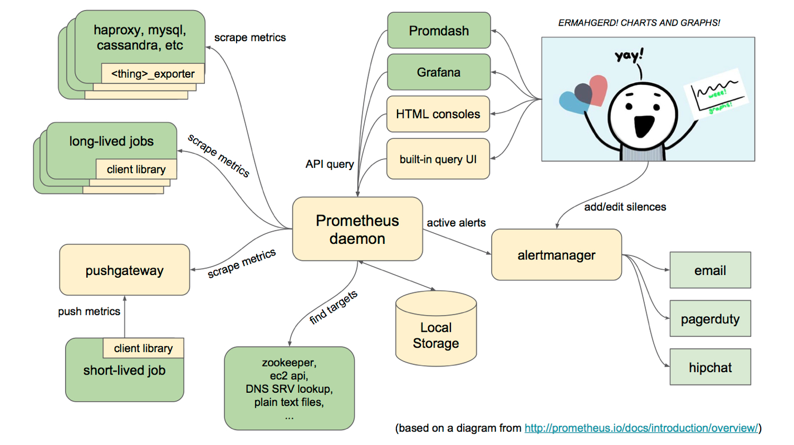

# prometheus的使用

## 系统架构

prometheus系统架构可参考下面这幅图。


## 下载并运行

[下载](https://github.com/prometheus/prometheus/releases)Prometheus，然后提取并运行：

```
tar xvfz prometheus-*.tar.gz
cd prometheus-*
./prometheus
```

## 配置yml

根据文档进行yml配置文件的配置，此处不再多解释。

[完整配置文档](https://prometheus.io/docs/prometheus/latest/configuration/configuration/)

kingshard暴露了9708端口作为prometheus的抓取地址，因此通过`http://localhost:8080/metrics`可以获取到相关监控项，端口可在配置文件进行变更。

## 启动

根据上述的配置文件启动prometheus

```
./prometheus -config.file=prometheus.yml
```

## 监控项解释

除了golang本身的监控项外，主要提供了以下的监控项。

### idle监控项

标明了当前系统中idle连接的数目，正常为最大连接减去cache连接的数目

```
# HELP idleConn the db idle connection
# TYPE idleConn gauge
idleConn{addr="10.10.60.189:3306",type="master"} 384
idleConn{addr="10.10.60.189:3307",type="slave"} 384
idleConn{addr="10.10.60.189:3308",type="slave"} 384
```

### cache监控项

标明了当前系统中cache连接的数目，正常为最大连接减去idle连接的数目，负载不大的系统该项变化应该不大

```
# HELP cacheConns the db cache connection
# TYPE cacheConns gauge
cacheConns{addr="10.10.60.189:3306",type="master"} 128
cacheConns{addr="10.10.60.189:3307",type="slave"} 128
cacheConns{addr="10.10.60.189:3308",type="slave"} 128
```

### maxConn监控项

标明了当前系统中配置的maxConn数量

```
# HELP maxConn the max connection config
# TYPE maxConn gauge
maxConn{addr="10.10.60.189:3306",type="master"} 512
maxConn{addr="10.10.60.189:3307",type="slave"} 512
maxConn{addr="10.10.60.189:3308",type="slave"} 512
```

### pushConnCount监控项

标明了当前系统中往连接池中推入连接的次数，用于排查异常情况

```
# HELP pushConnCount the db pushConnCount
# TYPE pushConnCount gauge
pushConnCount{addr="10.10.60.189:3306",type="master"} 512
pushConnCount{addr="10.10.60.189:3307",type="slave"} 512
pushConnCount{addr="10.10.60.189:3308",type="slave"} 512
```

### popConnCount监控项

标明了当前系统中从连接池中取出连接的次数，用于排查异常情况

```
# HELP popConnCount the db popConnCount
# TYPE popConnCount gauge
popConnCount{addr="10.10.60.189:3306",type="master"} 0
popConnCount{addr="10.10.60.189:3307",type="slave"} 0
popConnCount{addr="10.10.60.189:3308",type="slave"} 0
```